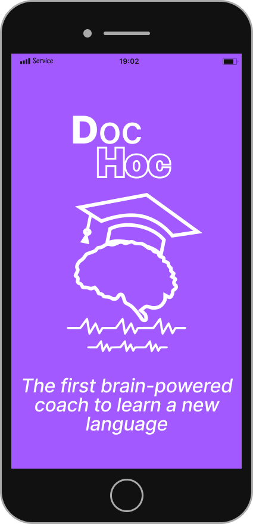
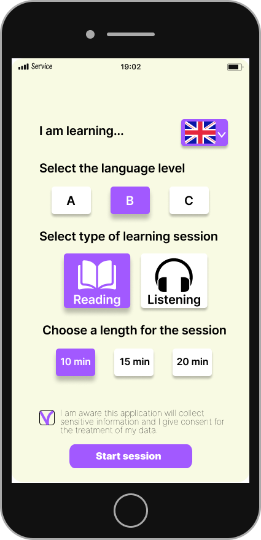
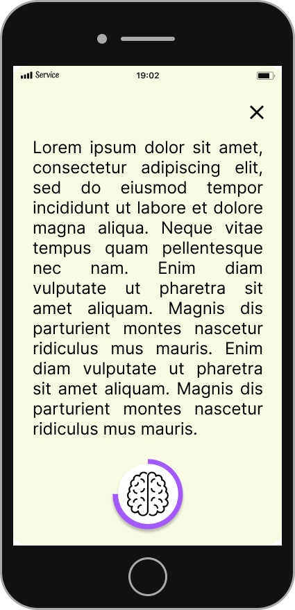
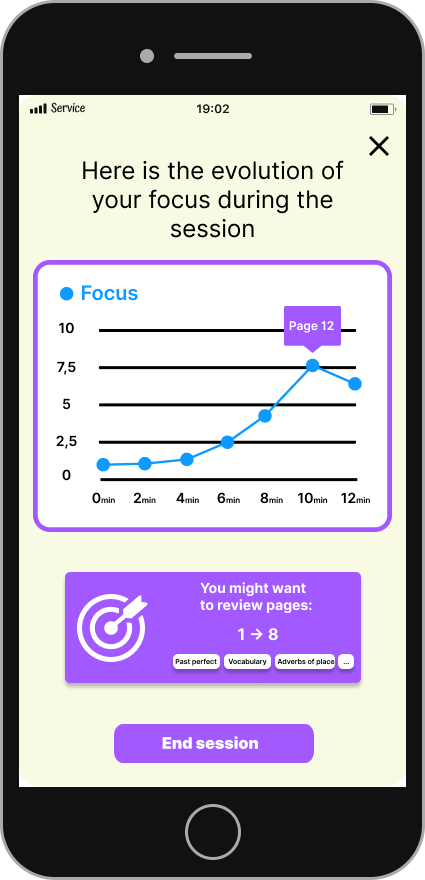
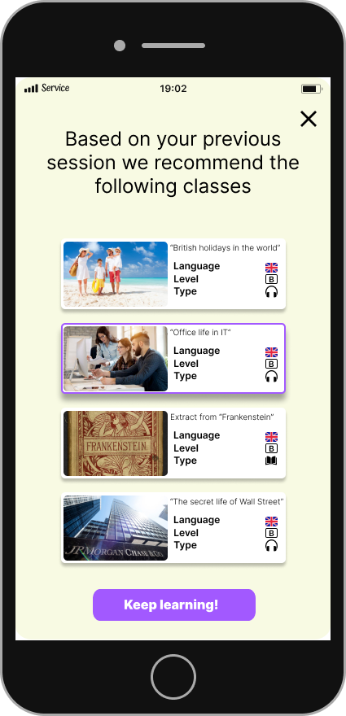

# Doc-Hoc: A BCI-powered Language Learning Assistant

Doc-Hoc's app design was born as part of the hackaton [BR41N.io](https://www.br41n.io/) organized by [G.Tec](https://www.gtec.at/). The motivation
beneath this design comes from the desire to bring BCI applications to the mass to solve real life
problems. One of such problems is the struggle to find the motivation and avoid the frustration
while learning a new language.
Learning a new language can be really challenging and many of the available apps for self-study are 
not able to provide feedback regarding the cognitive state of the student.
With Doc-Hoc the real-time analysis of the brain activity from the EEG signal can provide insights
regarding the level of Focus and Relaxation during the learning sessions.

The Focus metric can be used to:
- Provide an average Focus score at the end of a learning session
- Highlight the moments in which the student struggled to keep their focus
- Mark the topics on which the student was or wasn't able to focus and then recommend exercises accordingly

The Relaxation metric can be used to:
- Provide an average Relaxation score at the end of the learning session
- Determine which type of session and which topic made the student more comfortable
- Adjust the difficulty level of future learning session to keep the student engaged but not frustrated
- Recommend the learning session that more fit the pace and level of the student.

The prototype of the real-time processing engine was tested using a Cython board with 16 electrodes
from [OpenBCI](https://openbci.com/) and built on top of the [Brainflow](https://brainflow.org/) library.

## Concept Design
The design of the application was realized using Figma and Illustrator.

At the beginning the user is prompted to choose a language to learn, the
level they want to reach, the type of session to start with and the length
of the session

During the session the progress is shown with a loading bar that highlights
the fact that their brain activity is being processed in real-time.

At the end of the session the engine computes the Relaxation and Focus scores,
that are then prompted to the user.

The user can also look up more specific insights about the session to learn about 
their focus during each minute of the learning session. 

Finally, the user gets recommended some more learning sessions adapted to their previous 
performances and preferences.

## Requirements for the Focus/Relaxation Engine

Install the version of python that you prefer (>=3.6) from here: https://www.python.org/.

Install the IDE that you prefer. For Python, I recommend PyCharm or VisualStudio Code.

Create a new folder called "GTec Hackaton 2022" (or whatever you prefer)

Go into that folder and open a new terminal, verify that Python is installed by launching 

`python --version`

Now lunch the following command to create a new virtual environment

`python -m venv hackaton` 

you can also specify a path if you wanna create in subfolders, for example

`python -m venv myenv/hackaton`

Then activate the virtual environment use the following command on Windows

`.\hackaton\Scripts\activate.bat`

or on Mac / Linux

`source hackaton/bin/activate`

Now your environment should be ready, let's check everything is ok by launching

`python --version`

Alright, now we are ready to install some libraries. First we want MNE for signal processing. It will take some
time, but you will have all the main libraries for handling and visualizing data, like NumPy, SciPy and Matplotlib.

`pip install mne[hdf5]`

Then we will install Brainflow to manage IO devices

`python -m pip install brainflow`

Finally, we are ready to open PyCharm and create a new project (or import this one if you pulled it from GitHub).
At this point remember to select the environment we just created by using the dropdown menu and selecting the 
environment reference  `hackaton\Scripts\python.exe` or `hackaton/bin/python` on Mac/Linux.

The engine can be run using the following command (using the virtual board with id -1):

`python main.py --board-id=-1`

If you own an OpenBCI board, you can instead use the following command (set the board-id and serial-id parameters accordingly):

`python main.py --board-id=2 --serial-id=COM5`